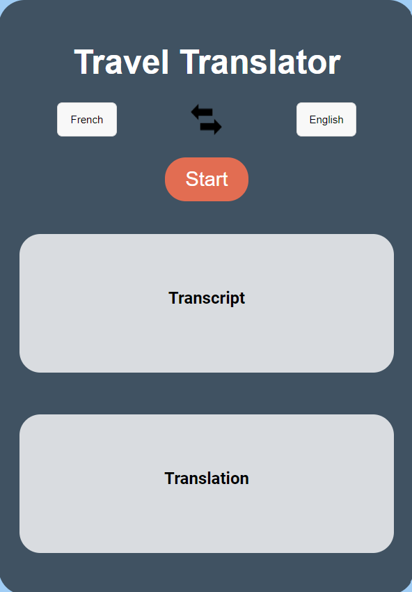

# Travel AI Translator

Travel AI Translator is a multi-language transcription and translation web application. The application allows users to record audio and transcribes the audio into the text of a selected language. Then, it translates the transcribed text into another selected language and returns an audio output of the translated text. This entire process is powered by OpenAI's API, ensuring high accuracy and efficient translation.

</br>

<div align="center">
    
</div>

## Demo

To see the Travel AI Translator in action, please visit the live demo [here](https://lfontaine.pythonanywhere.com/). This demo is hosted on PythonAnywhere, an online platform that supports Python web applications. Try recording your own voice and see how efficiently and accurately it transcribes and translates your words. This tool can greatly assist you during your travels or in any cross-language conversation scenario. Please contact me by email to get access to the demo. Happy Travels and Translations!

## Table of Contents

1. [Getting Started](#getting-started)
2. [Built With](#built-with)
3. [How to Use](#how-to-use)
4. [Contribute](#contribute)
5. [License](#license)
6. [Contact](#contact)

## Getting Started

Follow the steps below to set up the project locally.

### Prerequisites

You need to have Python 3.9 and pip installed on your machine. You can download Python from here: https://www.python.org/downloads/.
You also need an API key for OpenAI API.

### Installation

1. Clone this repository:

    ```
    git clone https://github.com/Daugit/travel-translator.git
    ```

2. Install the required packages:

    ```
    pip install -r requirements.txt
    ```
    
3. **Configure the OpenAI API Key**

    Create a `config.ini` file at the root of the project. Enter your OpenAI API Key in the following format:

    ```ini
    [OPENAI_API]
    key = <your-key>
    ```

    Make sure to replace `<your-key>` with your actual OpenAI API Key.

4. Start the Flask server:

    ```
    python flask_app.py
    ```

5. Navigate to http://localhost:5009 in your web browser.

## Built With

- HTML
- CSS
- JavaScript
- Python
- Flask
- OpenAI API
- Google Text-to-Speech API

## Supported languages
Our project proudly supports a vast number of languages to cater to a global audience. The currently supported languages include:

Afrikaans, Arabic, Armenian, Azerbaijani, Belarusian, Bosnian, Bulgarian, Catalan, Chinese, Croatian, Czech, Danish, Dutch, English, Estonian, Finnish, French, Galician, German, Greek, Hebrew, Hindi, Hungarian, Icelandic, Indonesian, Italian, Japanese, Kannada, Kazakh, Korean, Latvian, Lithuanian, Macedonian, Malay, Marathi, Maori, Nepali, Norwegian, Persian, Polish, Portuguese, Romanian, Russian, Serbian, Slovak, Slovenian, Spanish, Swahili, Swedish, Tagalog, Tamil, Thai, Turkish, Ukrainian, Urdu, Vietnamese, and Welsh.

## How to Use

1. Select the input language - this is the language of your audio input.

2. Select the output language - this is the language into which you want the audio input to be translated.

3. Click the "Start" button to start recording your voice. The button will change to "Stop".

4. Speak into your device's microphone in the selected input language.

5. Click the "Stop" button to stop recording. The application will transcribe the audio, translate it to the selected output language, and provide the translation as text and audio.

6. To swap the input and output languages, click on the arrow between the language selectors.

## Contribute

Contributions are always welcome! Thanks !

## License

This project is licensed under the MIT License - see the [LICENSE](LICENSE.md) file for details.

## Contact

For any inquiries, feedback, or suggestions, please feel free to reach out to me. I am always eager to discuss this project, potential improvements, or any other topics of interest. You can contact me directly via email at [lf94777@gmail.com](mailto:lf94777@gmail.com). I look forward to hearing from you and working together to improve and expand this tool's capabilities!
