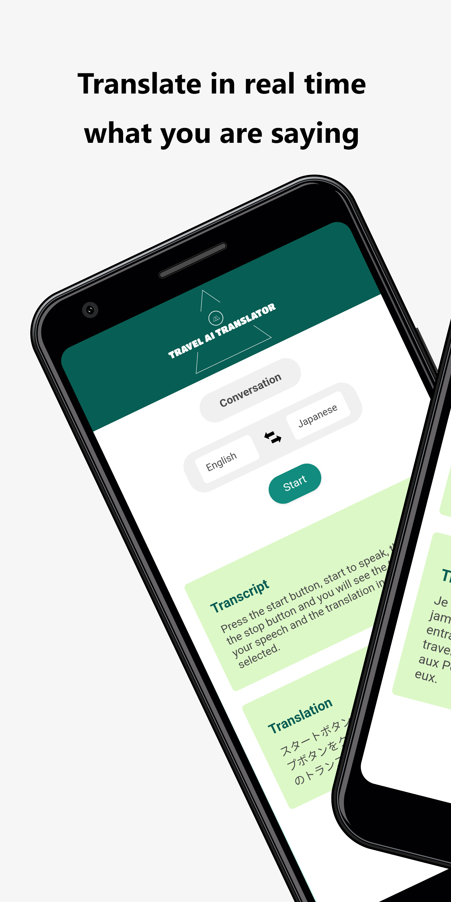
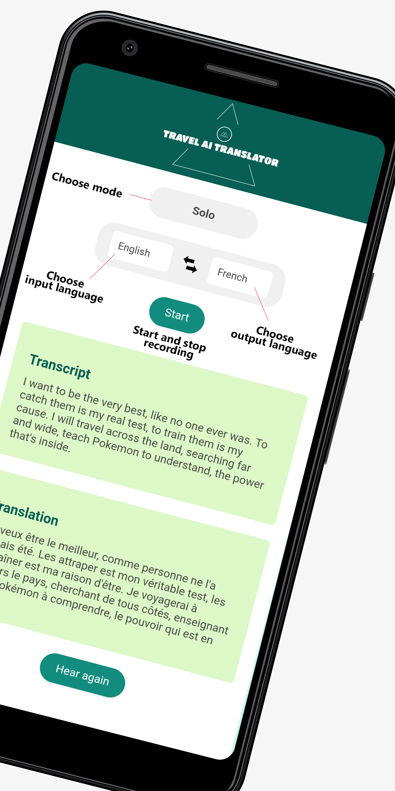

# Travel AI Translator

This repository is a template for anyone wishing to build quickly a web application using the following technologies:
- Flask
- OpenAI Speech-to-text API
- OpenAI GPT API 
- Google Text-to-Speech API

You are welcome to inspire and use the code freely for your own projects.

The showcase application, Travel AI Translator, is a multi-language transcription and translation web application. The application allows users to record audio and transcribes the audio into the text of a selected language. Then, it translates the transcribed text into another selected language and returns an audio output of the translated text. This entire process is powered by OpenAI's API, ensuring high accuracy and efficient translation.

</br>

<div align="center">
    
	
</div>

## Demo

To see the Travel AI Translator in action, please visit the live demo webapp [here](https://lfontaine.pythonanywhere.com/) or download the android app on the Play Store [here](https://play.google.com/store/apps/details?id=com.end2endai.traveltranslatorai&pcampaignid=web_share).

Try recording your own voice and see how efficiently and accurately it transcribes and translates your words. This tool can greatly assist you during your travels or in any cross-language conversation scenario. 

## Table of Contents

1. [Getting Started](#getting-started)
2. [Prerequisites](#prerequisites)
3. [Installation](#installation)
4. [Built With](#built-with)
5. [Supported languages](#supported-languages)
6. [How to Use](#how-to-use)
7. [Contribute](#contribute)
8. [License](#license)
9. [Confidentiality rules](#confidentiality-rules)
10. [Contact](#contact)

## Getting Started

Follow the steps below to set up the project locally.

### Prerequisites

You need to have Python 3.9 and pip installed on your machine. You can download Python from here: https://www.python.org/downloads/.
You also need an API key for OpenAI API.

### Installation

1. Clone this repository:

    ```
    git clone https://github.com/Daugit/travel-translator.git
    ```

2. Install the required packages:

    ```
    pip install -r requirements.txt
    ```
    
3. Configure the OpenAI API Key

    Create a `config.ini` file at the root of the project. Enter your OpenAI API Key in the following format:

    ```ini
    [OPENAI_API]
    key = <your-key>
    ```

    Make sure to replace `<your-key>` with your actual OpenAI API Key.

3. Generate a self signed certificate
    In order to be able to record audio in a browser, the flask app needs to have SSL certificates.

    Open a Terminal or Command Prompt in this project folder:

    - On Unix-based systems, you can open a terminal.
    - On Windows, you can use `git bash`

    Generate a Private Key:
    - Execute the following command to generate a private key (key.pem): ```openssl genrsa -out key.pem 2048```
    This command creates a 2048-bit RSA private key. You can adjust the bit length for stronger encryption, but 2048 is generally sufficient.
    - Generate a Self-Signed Certificate:
    Now, generate a self-signed certificate (cert.pem) using the private key: ```openssl req -new -x509 -key key.pem -out cert.pem -days 365```
    This command will prompt you to enter various details like country name, state, organization, etc. These details are used to fill in the certificate's subject field.

4. Start the Flask server:
    In Anaconda Prompt :
    ```
    flask --app app.py run --port 5009 --host 0.0.0.0
    ```

5. Navigate to http://localhost:5009 in your web browser.

## Built With

- HTML
- CSS
- JavaScript
- Python
- Flask
- OpenAI API
- Google Text-to-Speech API

## Supported languages

Our project proudly supports a vast number of languages to cater to a global audience. The currently supported languages include:

Afrikaans, Arabic, Armenian, Azerbaijani, Belarusian, Bosnian, Bulgarian, Catalan, Chinese, Croatian, Czech, Danish, Dutch, English, Estonian, Finnish, French, Galician, German, Greek, Hebrew, Hindi, Hungarian, Icelandic, Indonesian, Italian, Japanese, Kannada, Kazakh, Korean, Latvian, Lithuanian, Macedonian, Malay, Marathi, Maori, Nepali, Norwegian, Persian, Polish, Portuguese, Romanian, Russian, Serbian, Slovak, Slovenian, Spanish, Swahili, Swedish, Tagalog, Tamil, Thai, Turkish, Ukrainian, Urdu, Vietnamese, and Welsh.

## How to Use

1. Select the input language - this is the language of your audio input.
2. Select the output language - this is the language into which you want the audio input to be translated.
3. Click the "Start" button to start recording your voice. The button will change to "Stop".
4. Speak into your device's microphone in the selected input language.
5. Click the "Stop" button to stop recording. The application will transcribe the audio, translate it to the selected output language, and provide the translation as text and audio.
6. To swap the input and output languages, click on the arrow between the language selectors.

## Contribute

Contributions are always welcome! Thanks !

## License

This project is licensed under the MIT License - see the [LICENSE](LICENSE.md) file for details.

## Confidentiality Rules

We prioritize the privacy and confidentiality of our users. All audio recordings and transcriptions are processed securely using OpenAI's API and Google Text-to-Speech API. While these services ensure high accuracy and efficient translation, we want to assure our users that we do not store, share, or use your audio recordings and translations for any purpose other than to provide you with the service. Both OpenAI and Google have stringent data protection standards, and any data sent to their APIs is used solely for the purpose of transcription and translation. When using our application on the Android Play Store, rest assured that your data remains private and is treated with the utmost care. We are committed to upholding the highest standards of data protection and encourage users to review our privacy policy, as well as those of OpenAI and Google, for further details.


## Contact

For any inquiries, feedback, or suggestions, please feel free to reach out to me. I am always eager to discuss this project, potential improvements, or any other topics of interest. You can contact me directly via email at [lf94777@gmail.com](mailto:lf94777@gmail.com). I look forward to hearing from you and working together to improve and expand this tool's capabilities!
