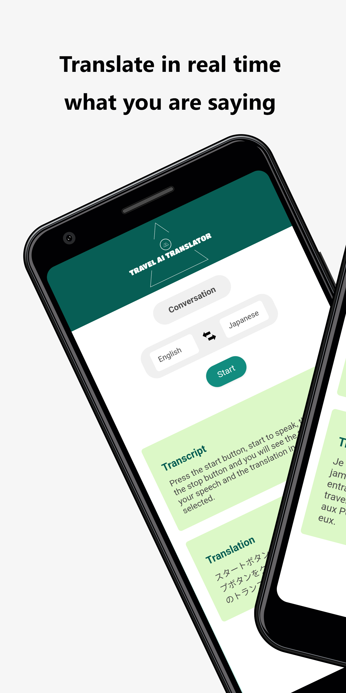
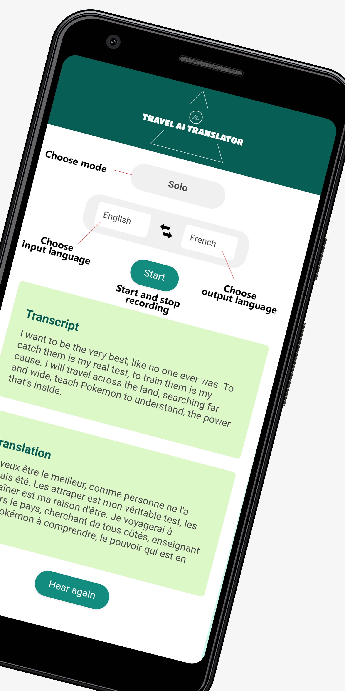

# Travel AI Translator

This repository is a template for anyone wishing to build quickly a web application using the following technologies:
- Flask
- OpenAI Speech-to-text API (Whisper)
- OpenAI GPT API (GPT-4o-mini)
- Google Text-to-Speech API

You are welcome to inspire and use the code freely for your own projects.

The showcase application, Travel AI Translator, is a multi-language transcription and translation web application. The application allows users to record audio and transcribes the audio into the text of a selected language. Then, it translates the transcribed text into another selected language and returns an audio output of the translated text. This entire process is powered by OpenAI's API, ensuring high accuracy and efficient translation.

</br>

<div align="center">
    
	
</div>

## Demo

To see the Travel AI Translator in action, please visit the live demo webapp [here](https://lfontaine.pythonanywhere.com/) or download the android app on the Play Store [here](https://play.google.com/store/apps/details?id=com.end2endai.traveltranslatorai&pcampaignid=web_share).

Try recording your own voice and see how efficiently and accurately it transcribes and translates your words. This tool can greatly assist you during your travels or in any cross-language conversation scenario.

## Table of Contents

1. [Getting Started](#getting-started)
2. [Prerequisites](#prerequisites)
3. [Installation](#installation)
4. [Deployment](#deployment)
5. [Built With](#built-with)
6. [Supported languages](#supported-languages)
7. [How to Use](#how-to-use)
8. [Contribute](#contribute)
9. [License](#license)
10. [Confidentiality rules](#confidentiality-rules)
11. [Contact](#contact)

## Getting Started

Follow the steps below to set up the project locally.

### Prerequisites

- Python 3.9+ and pip
- An [OpenAI API key](https://platform.openai.com/api-keys)

### Installation

1. Clone this repository:

    ```bash
    git clone https://github.com/End2EndAI/travel-ai-translator.git
    cd travel-ai-translator
    ```

2. Install the required packages:

    ```bash
    pip install -r requirements.txt
    ```

3. Configure the OpenAI API Key

    **Option A — environment variable (recommended):**
    ```bash
    export OPENAI_API_KEY=your-key-here
    ```

    **Option B — config.ini file:**

    Create a `config.ini` file at the root of the project:
    ```ini
    [OPENAI_API]
    key = your-key-here
    ```

4. Generate SSL certificates

    Browser microphone access requires HTTPS. Generate a self-signed certificate for local development:

    ```bash
    openssl genrsa -out key.pem 2048
    openssl req -new -x509 -key key.pem -out cert.pem -days 365 -subj "/CN=localhost"
    ```

5. Start the Flask server:

    ```bash
    flask --app app.py run --port 5009 --host 0.0.0.0 --cert=cert.pem --key=key.pem
    ```

6. Navigate to `https://localhost:5009` in your web browser.

    > Your browser will show a security warning for the self-signed certificate — click "Advanced" and proceed.

---

## Deployment

### Vercel

Vercel runs Flask as a serverless Python function. The `vercel.json` and `api/index.py` files are already included in this repository.

1. **Install the Vercel CLI:**
    ```bash
    npm install -g vercel
    ```

2. **Log in to Vercel:**
    ```bash
    vercel login
    ```

3. **Deploy:**
    ```bash
    vercel --prod
    ```

    Vercel will detect `vercel.json` and deploy automatically.

4. **Set environment variables** in the [Vercel dashboard](https://vercel.com/dashboard) under your project → Settings → Environment Variables:

    | Variable | Description |
    |---|---|
    | `OPENAI_API_KEY` | Your OpenAI API key |
    | `SECRET_KEY` | A random secret for Flask sessions |

    Or set them via CLI:
    ```bash
    vercel env add OPENAI_API_KEY
    vercel env add SECRET_KEY
    ```

5. Your app is live at `your-project.vercel.app`.

    > **Note:** Vercel provides HTTPS automatically — browser microphone access works out of the box, no SSL certificate setup needed.

    > **Note:** Audio files are stored in `/tmp` on Vercel (the filesystem is otherwise read-only on serverless). Files are ephemeral and served directly by the app — this works fine since audio is played immediately after translation.

---

### Render (free tier available)

[Render](https://render.com) deploys directly from GitHub with zero configuration.

1. **Push your code** to a GitHub repository.

2. **Create a new Web Service** on Render and connect your GitHub repo.

3. Set the following:
   - **Runtime:** Python 3
   - **Build command:** `pip install -r requirements.txt`
   - **Start command:** `gunicorn app:app`

4. Add `gunicorn` to your requirements:
    ```bash
    echo "gunicorn" >> requirements.txt
    ```

5. **Add environment variables** in the Render dashboard:
   - `OPENAI_API_KEY` = your OpenAI key
   - `SECRET_KEY` = a random string (e.g. `python -c "import secrets; print(secrets.token_hex(32))"`)

6. Deploy. Render provides HTTPS automatically.

    > **Note:** Browser microphone access works out of the box on Render since the app is served over HTTPS.

---

### Environment Variables Reference

| Variable | Required | Description |
|---|---|---|
| `OPENAI_API_KEY` | Yes | Your OpenAI API key |
| `SECRET_KEY` | No | Flask session secret (auto-generated if not set) |
| `PORT` | No | Port to run on locally (default: `5009`) |
| `SSL_CERT` | No | Path to SSL cert for local dev (default: `cert.pem`) |
| `SSL_KEY` | No | Path to SSL key for local dev (default: `key.pem`) |

---

## Built With

- HTML
- CSS
- JavaScript
- Python
- Flask
- OpenAI API (Whisper + GPT-4o-mini)
- Google Text-to-Speech API

## Supported languages

Our project proudly supports a vast number of languages to cater to a global audience. The currently supported languages include:

Afrikaans, Arabic, Armenian, Azerbaijani, Belarusian, Bosnian, Bulgarian, Catalan, Chinese, Croatian, Czech, Danish, Dutch, English, Estonian, Finnish, French, Galician, German, Greek, Hebrew, Hindi, Hungarian, Icelandic, Indonesian, Italian, Japanese, Kannada, Kazakh, Korean, Latvian, Lithuanian, Macedonian, Malay, Marathi, Maori, Nepali, Norwegian, Persian, Polish, Portuguese, Romanian, Russian, Serbian, Slovak, Slovenian, Spanish, Swahili, Swedish, Tagalog, Tamil, Thai, Turkish, Ukrainian, Urdu, Vietnamese, and Welsh.

## How to Use

1. Select the input language — this is the language you will speak.
2. Select the output language — this is the language you want the translation in.
3. Click **Start** to begin recording. The button turns red and pulses while recording.
4. Speak into your device's microphone.
5. Click **Stop**. The app transcribes your speech, translates it, and plays the audio translation.
6. Use the **copy** buttons (📋) next to Transcript or Translation to copy the text.
7. Click **Clear** to reset the output for a new recording.
8. Click **Hear again** to replay the last translation audio.
9. Click the arrow between languages to swap input and output.
10. Switch to **Conversation** mode to automatically swap languages after each translation — useful for back-and-forth dialogue.

## Contribute

Contributions are always welcome! Thanks!

## License

This project is licensed under the MIT License - see the [LICENSE](LICENSE.md) file for details.

## Confidentiality Rules

We prioritize the privacy and confidentiality of our users. All audio recordings and transcriptions are processed securely using OpenAI's API and Google Text-to-Speech API. While these services ensure high accuracy and efficient translation, we want to assure our users that we do not store, share, or use your audio recordings and translations for any purpose other than to provide you with the service. Both OpenAI and Google have stringent data protection standards, and any data sent to their APIs is used solely for the purpose of transcription and translation. When using our application on the Android Play Store, rest assured that your data remains private and is treated with the utmost care. We are committed to upholding the highest standards of data protection and encourage users to review our privacy policy, as well as those of OpenAI and Google, for further details.

## Contact

For any inquiries, feedback, or suggestions, please feel free to reach out to me. I am always eager to discuss this project, potential improvements, or any other topics of interest. You can contact me directly via email at [louis.fontaine.pro@gmail.com](mailto:louis.fontaine.pro@gmail.com). I look forward to hearing from you and working together to improve and expand this tool's capabilities!
